## [日期 時間]

- 平台：CDX
- 題組：2024資安女婕思
- 練習耗時：25:55
- 完成題數：8 題
- 累積分數：46000 分
- 本次狀況：最後兩題因靶機異常未完成。

### 補充紀錄
- 今天比較順的題型：web漏洞
- 卡最久的題目：crypto 需要一段shift
- 關鍵突破點：wireshark
- 值得留意的工具 / 指令：cyberchef nmap wireshark

## LV1

```
    Lcj kcxxm bcj aykkgl bg lmqrpy tgry
kg pgrpmtyg ncp sly qcjty mqaspy
afé jy bgpgrry tgy cpy qkyppgry. 89cc  

    Elm uyerxs e hmv uyep ive è gswe hyve
iwxe wipze wipzekkme i ewtve i jsvxi
gli rip tirwmiv vmrsze pe teyve! j5h9 

    Bivb’è iuizi kpm xwkw è xqù uwzbm;
ui xmz bzibbiz lmt jmv kp’q’ dq bzwdiq,
lqzò lm t’itbzm kwam kp’q’ d’pw akwzbm. mnm9

    Ye ded ie rud hytyh sec’y’ l’ydjhqy,
jqdj’uhq fyud ty iedde q gkub fkdje
sxu bq luhqsu lyq qrrqdtedqy. tv4t

    Ft ihb va’b’ ynb te ibè w’ng vheex zbngmh,
eà whox mxkfbgtot jnxeet oteex
vax f’toxt wb itnkt be vhk vhfingmh,

    zntkwtb bg temh, x obwb ex lnx liteex
oxlmbmx zbà wx’ ktzzb wxe ibtgxmt
vax fxgt wkbmmh temknb ixk hzgx vteex. 41x8

    Nyybe sh yn cnhen ha cbpb dhrgn
pur ary yntb qry pbe z’ren qhengn
yn abggr pu’v’ cnffnv pba gnagn cvrgn. q060

    H frph txhl fkh frq ohqd diidqqdwd
xvflwr ixru gho shodjr d od ulyd
vl yrojh d o’dftxd shuljolrvd h jxdwd,

    frvì o’dqlpr plr, fk’dqfru ixjjlyd,
vl yrovh d uhwur d ulpludu or sdvvr
fkh qrq odvflò jlà pdl shuvrqd ylyd. 4f8f

    Wvp jo’èp wvzhav bu wvjv ps jvywv shzzv,
ypwylzp cph wly sh wphnnph kpzlyah,
zì jol ’s wpè mlytv zltwyl lyh ’s wpù ihzzv. i19h
```

CryberChref 先尋找第一行原文發現他是 **義大利**語詩句出自但丁·阿利吉耶里的神曲·地獄篇

推算出下一段移位

我發現每段結尾是hash所以我認為他是flag

```
flag:89eef5d9efe9df4d41e8d0604c8cb19a
```

## Lv2
使用hexed辨識

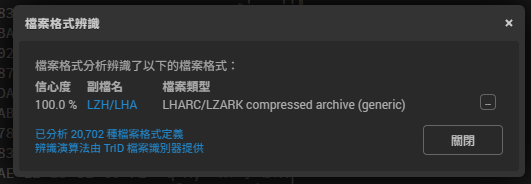

發現他是一個壓縮檔，解壓完出現src/bin

PE32檔我就聯想就是要逆向

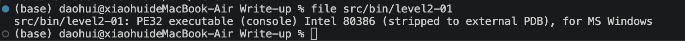

我來使用ida分析檔案
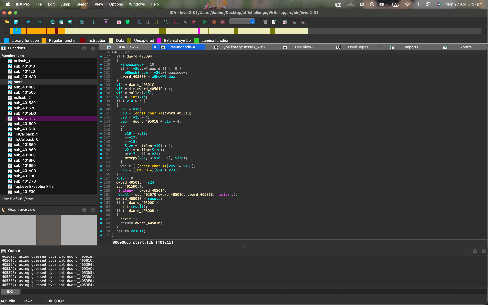

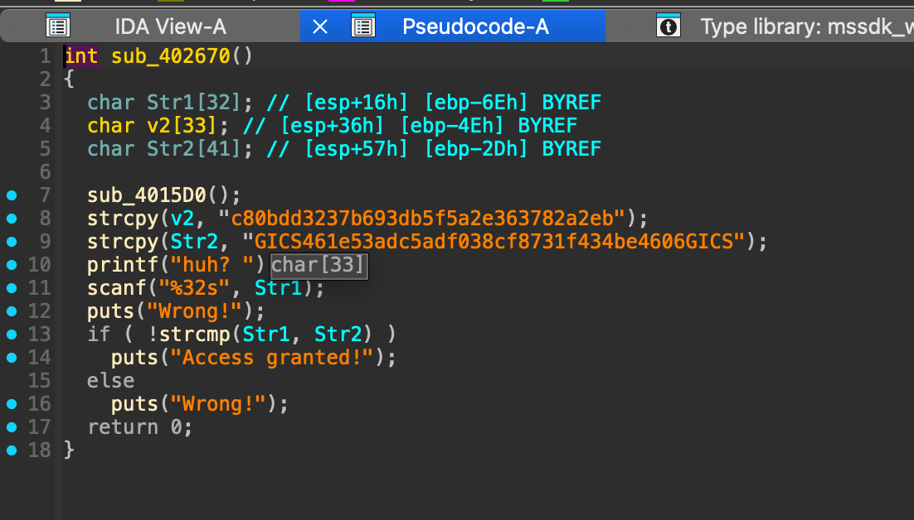

```
flag:GICS461e53adc5adf038cf8731f434be4606GICS
可是他是用hash所提取
hash:461e53adc5adf038cf8731f434be4606
```

## Lv3

照片就是osint 先檢查exif

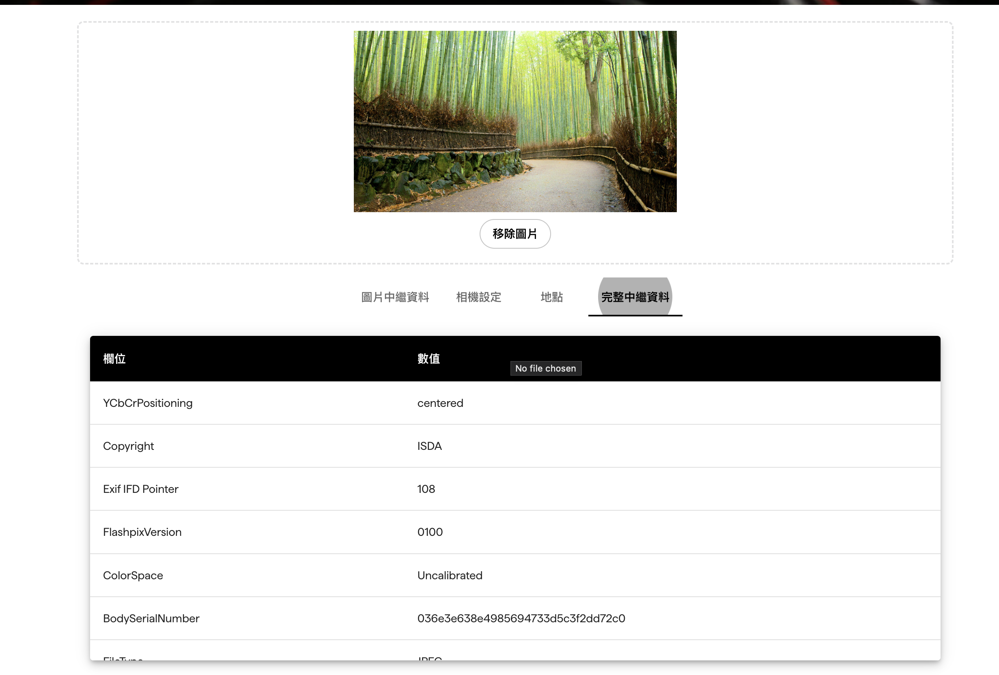

發現BodySerialNumber就是hash

```
flag:036e3e638e4985694733d5c3f2dd72c0
```

## Lv4

收先偵查主機資訊
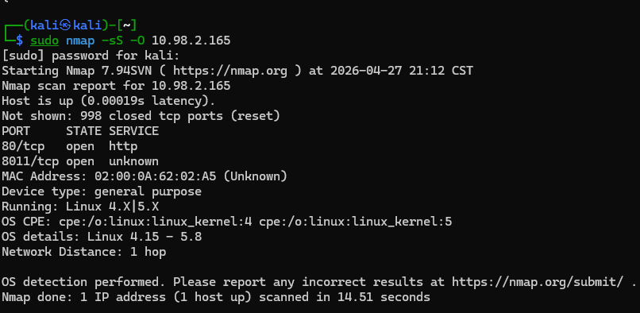
發現無法掃描全部端口

所以使用這段
```
sudo nmap -sS -sV -sC -A -p- -T4 -oA scan_results <ip>
```
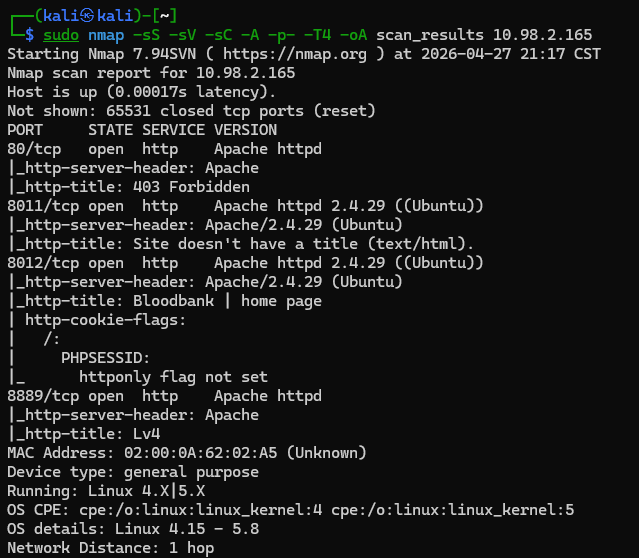

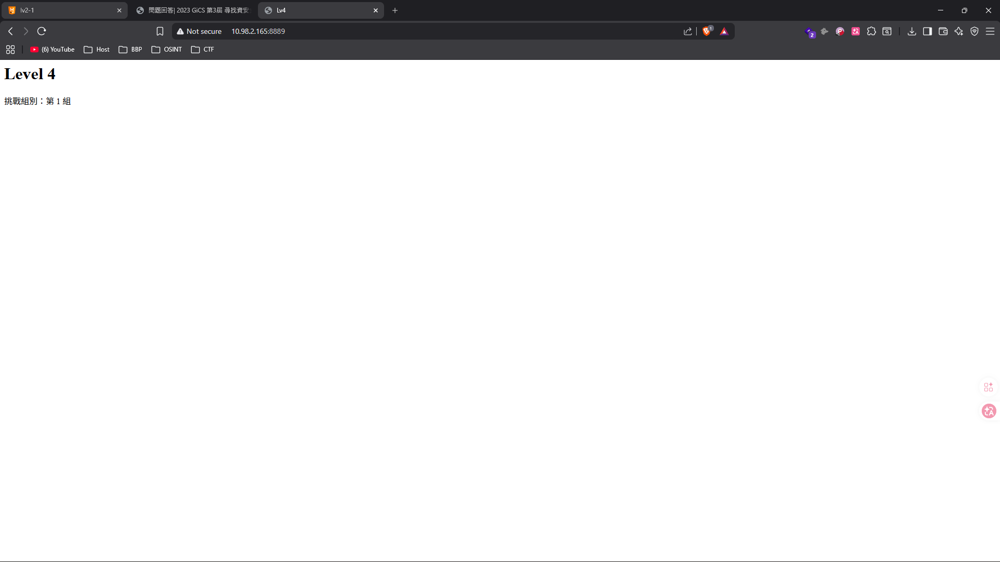

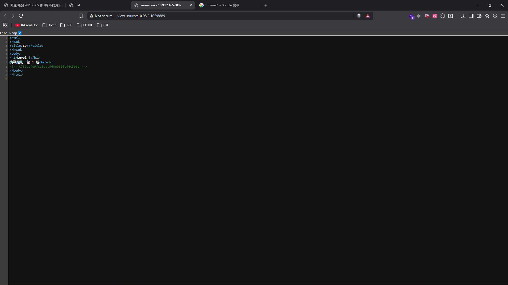

```
flag:c739bbfe9fca5aab960e0608b94c3b6a 
```

## Lv5

XSS注入

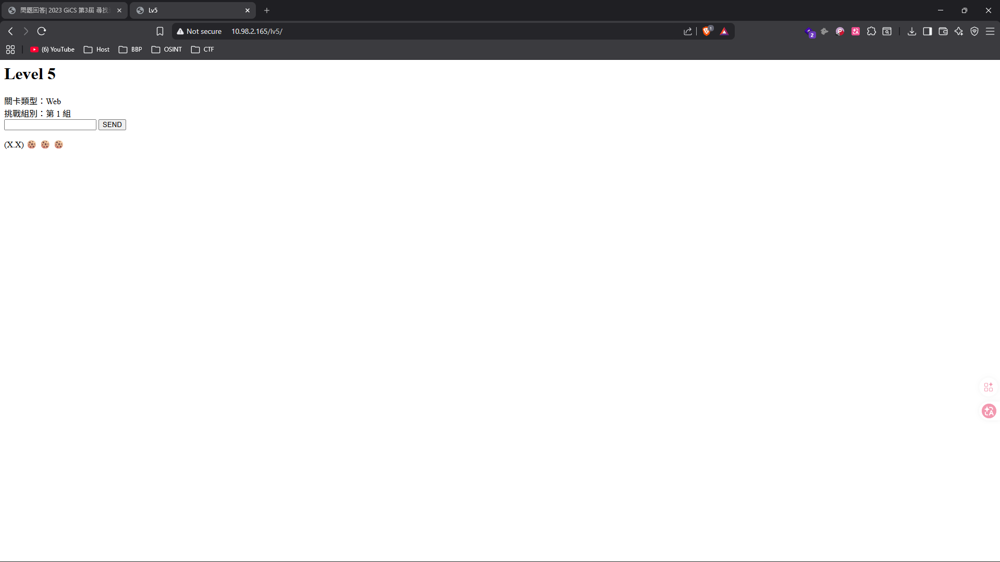

先測試
```
<script>alert('XSS');</script>
```

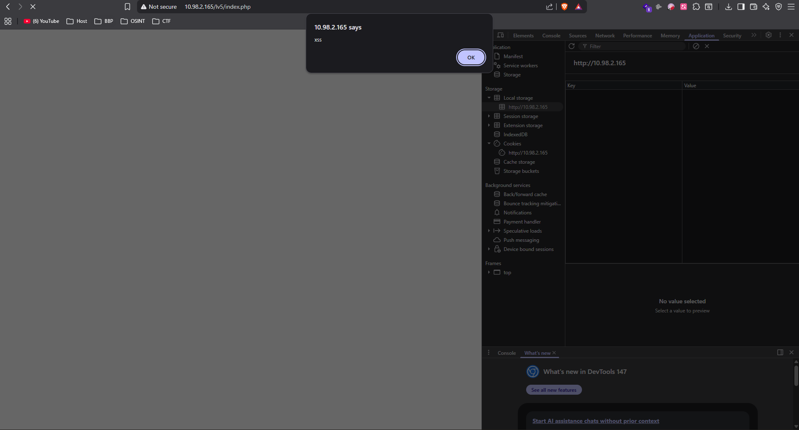

```
<script>alert(document.cookie)</script>
```
哭ki好吃


```
flag:f1f62aa66026020a3d4a994ded9fc6c9
```


# Lv6

分析流量
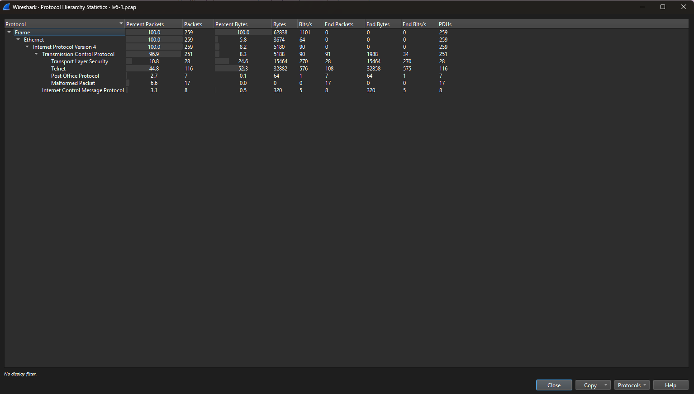
在IPV4的TCP裡面Telnet最高

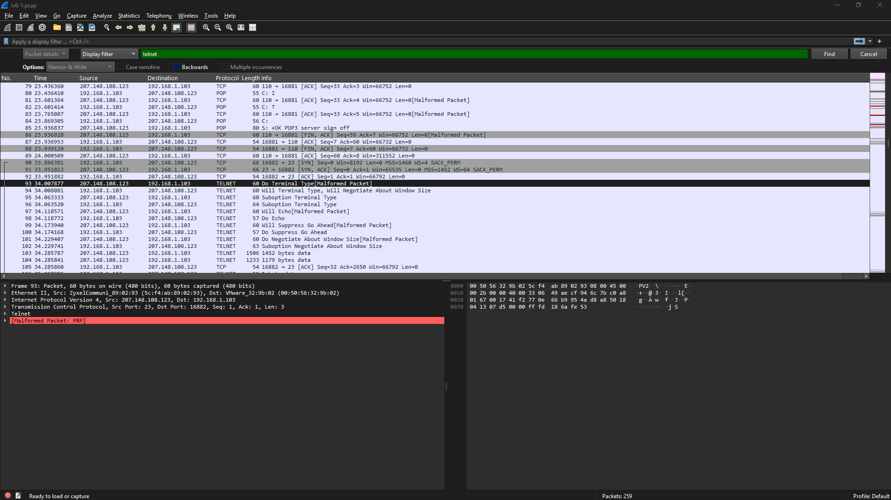

我不想找了直接哪現成write up 圖片
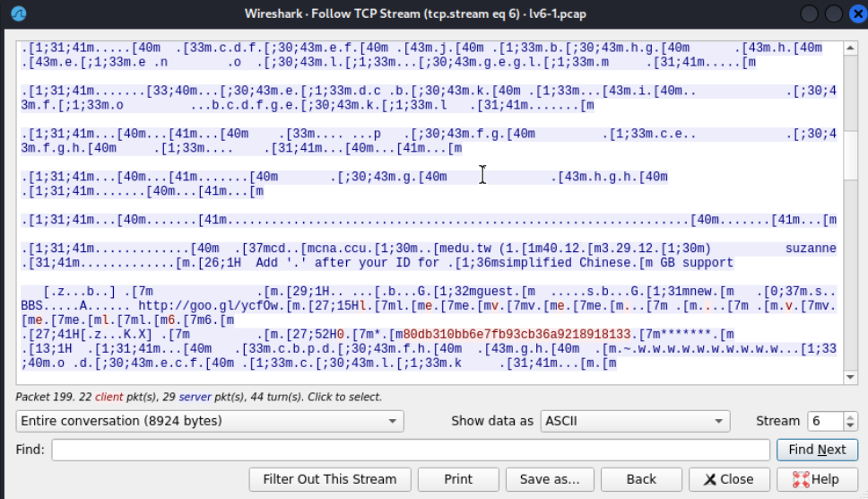
改conversation
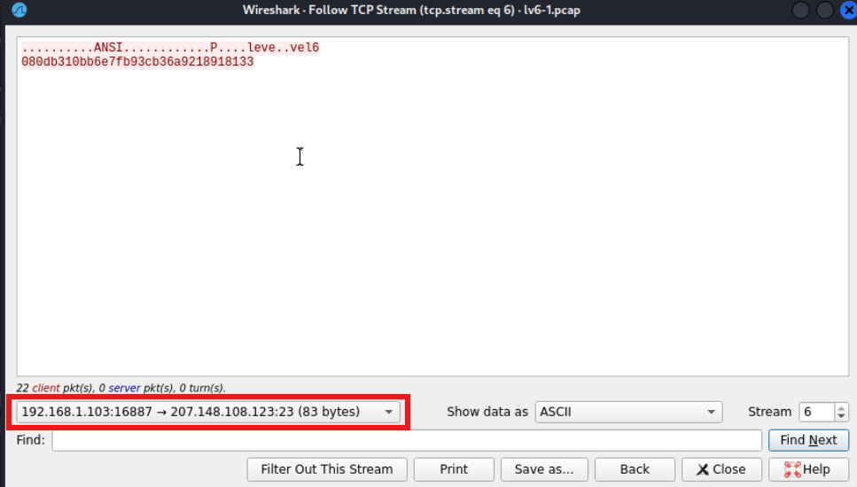

```
hash:080db310bb6e7fb93cb36a9218918133
```

## Lv7
base64解碼
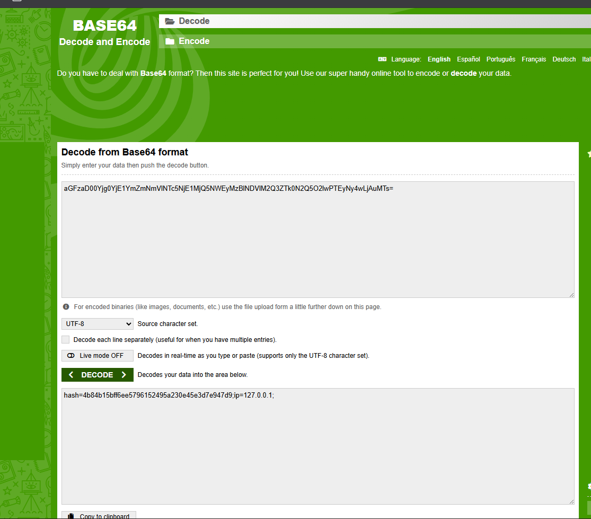
hash檢查
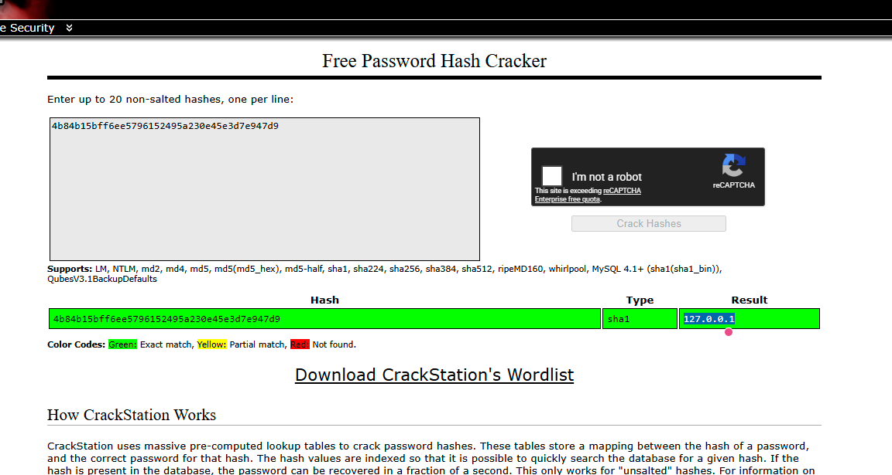
hash生成sha-1
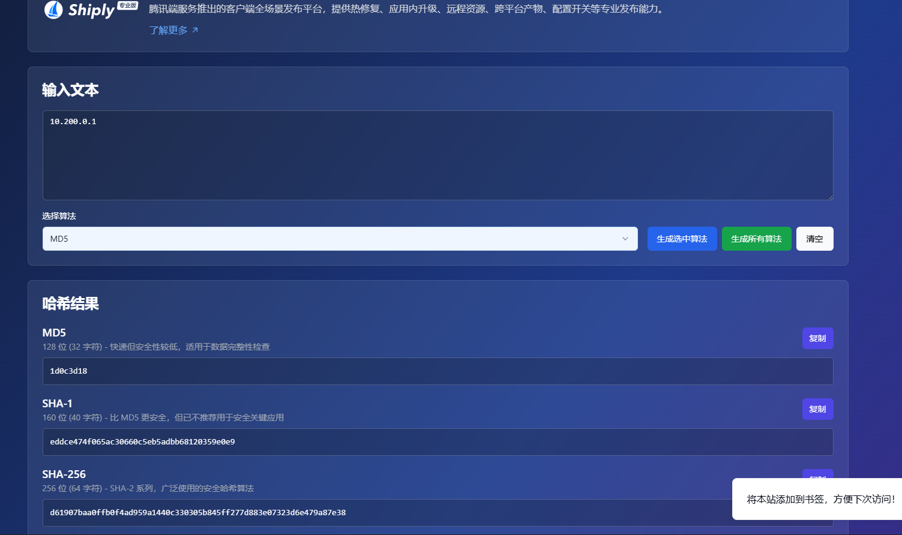
base64轉碼
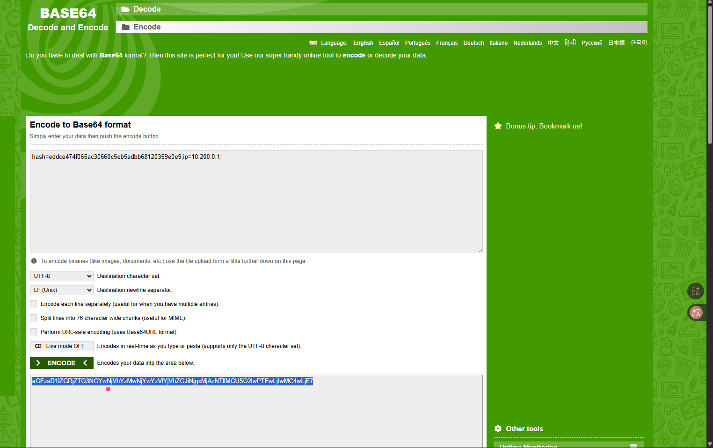


```
aGFzaD1lZGRjZTQ3NGYwNjVhYzMwNjYwYzVlYjVhZGJiNjgxMjAzNTllMGU5O2lwPTEwLjIwMC4wLjE7
```

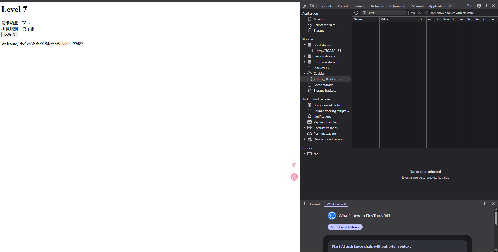

```
hash:7be1e45b5bf058dcceaa909955499d87
```


# Lv8

我使用pwn來提取

```py
from pwn import *
import zipfile
import io

# 設定檔案路徑
input_file = './8.zip'
target_pdf_name = 'zip_1.pdf'

log.info(f"正在分析檔案: {input_file}")

try:
    with open(input_file, 'rb') as f:
        stream = f.read()
    
    # 檢查開頭是否為 PK..
    if stream[:2] != b'PK':
        log.warning(f"檔案標頭不正確: {stream[:4].hex()}")
        # 如果是之前提到的 0x00 填充，這裡會抓到
        start = stream.find(b'PK\x03\x04')
        if start != -1:
            log.info(f"在 {hex(start)} 處找到真正的標頭，正在修正...")
            stream = stream[start:]
    
    # 使用 zipfile 讀取修正後的流
    with zipfile.ZipFile(io.BytesIO(stream)) as z:
        all_files = z.namelist()
        log.info(f"ZIP 內容清單: {all_files}")
        
        if target_pdf_name in all_files:
            pdf_data = z.read(target_pdf_name)
            write('extracted_1.pdf', pdf_data)
            log.success(f"成功提取 {target_pdf_name}！")
        else:
            log.error(f"ZIP 內找不到名為 {target_pdf_name} 的檔案")

except Exception as e:
    log.error(f"發生錯誤: {e}")
    # 進入 Debug 模式：印出前 32 bytes 看看數據到底長什麼樣子
    log.info("數據前 32 bytes (Hex):")
    print(hexdump(stream[:32]))

```

```
flag:e88e2010466e43d9629ad1cdd81af43f 
```
